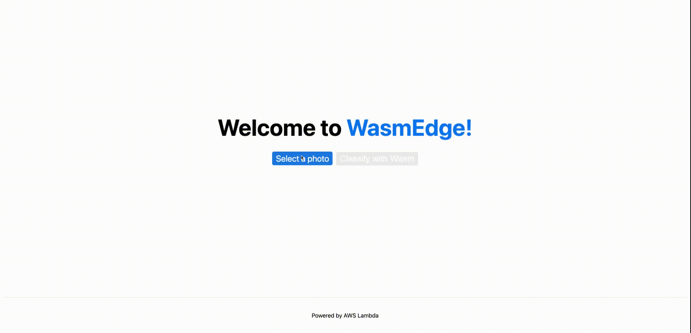
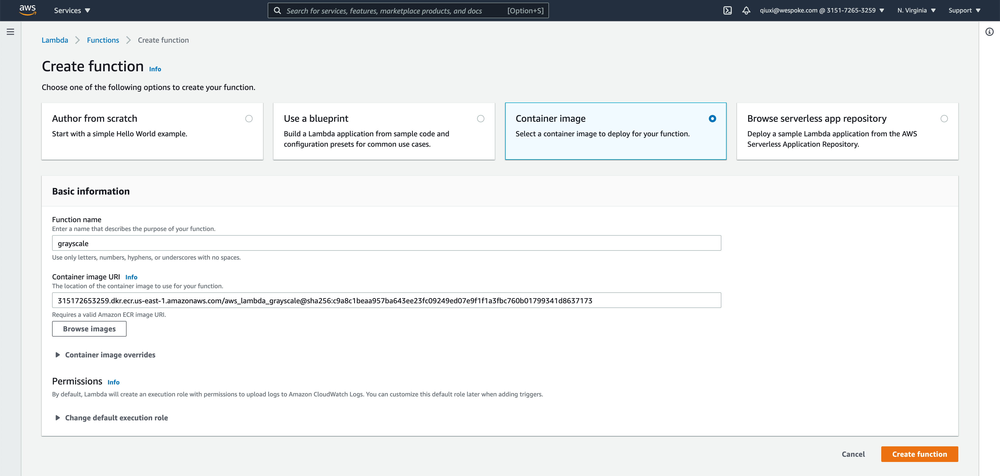
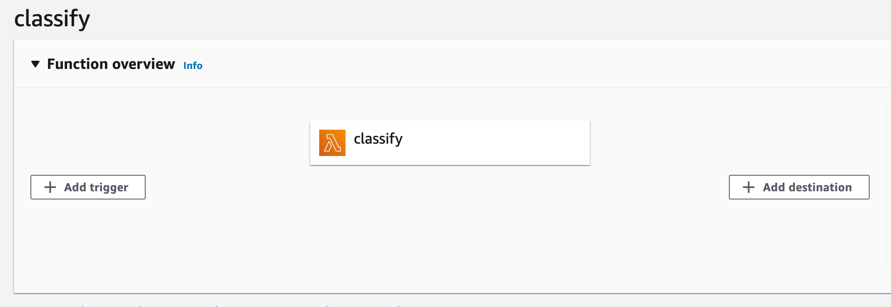
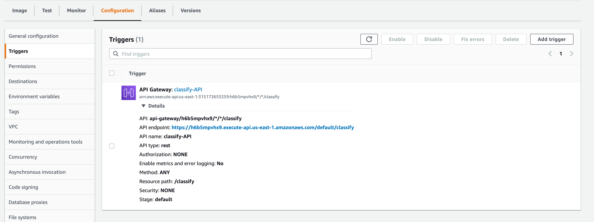
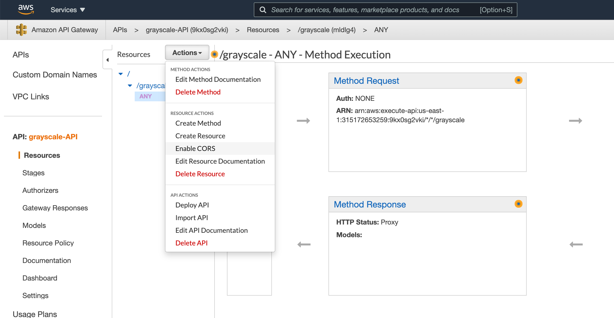
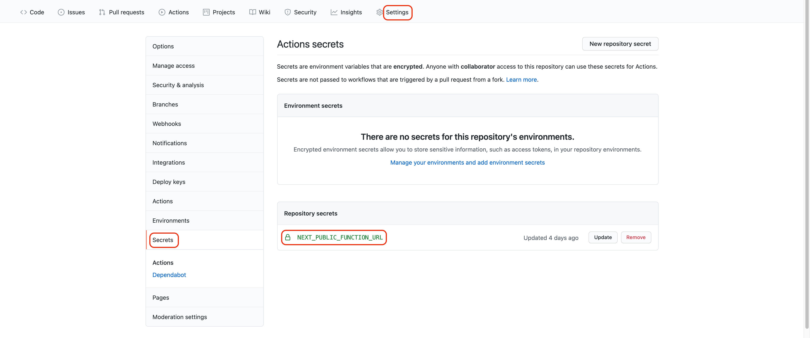

## [Demo for image processing](https://secondstate.github.io/aws-lambda-wasm-runtime/) | [Demo for tensorflow](https://robnanarivo.github.io/aws-lambda-wasm-runtime/)

This project is aimed to demonstrate how to implement a Serverless Functions working with WebAssembly in AWS Lambda, using our [WasmEdge runtime](https://github.com/WasmEdge/WasmEdge). Docker is also required for this demo.

The [main branch](https://github.com/second-state/aws-lambda-wasm-runtime/tree/main) showcases an image processing function, and the [tensorflow branch](https://github.com/second-state/aws-lambda-wasm-runtime/tree/tensorflow) showcases an AI inference function. Both written in simple Rust and runs in the [WasmEdge runtime](https://github.com/WasmEdge/WasmEdge) for WebAssembly.

## Function Overview

The Serverless Functions endpoint is located at [api/hello.js](#) to meet the requirement of AWS Lambda. AWS Lambda requires a [function handler](https://docs.aws.amazon.com/lambda/latest/dg/nodejs-handler.html) as the entry point for various events.

The only function in [api/hello.js](#) is `grayscale`, which transforms a colored image into a grayscale image. It receives a PNG file and pass it as STDIN stream to a spawned child process. The child process runs using the [WasmEdge](https://github.com/WasmEdge/WasmEdge) command.

File `api/functions/image-grayscale/src/main.rs` implements the grayscaling logic. You can build it with the Rust `cargo` command with the `-target wasm32-wasi` option to get the [grayscale.wasm](#) file.

We define custom build in [api/pre.sh](#) which is called in package.json to download the [WasmEdge command](https://github.com/WasmEdge/WasmEdge/releases/tag/0.8.2). 



## Deploy

### Create An Image Repository on Amazon ECR

Go to your Amazon [Elastic Container Registry](https://console.aws.amazon.com/ecr/repositories) (ECR) and create a new image repository. Note that you need to set the visibility settings to **Private** in order to use the image to create a serverless function on AWS Lambda.


### Build Your Docker Image Locally

We have everything we need to build a docker image in the [api/](#) folder. 

- [grayscale.wasm](#) is the WebAssembly function that turns a colored picture into black and white. grayscale.wasm is compiled from [main.rs](#) in [api/functions/image-grayscale/src](#), written in Rust.

- [hello.js](#) is the handler function that passes data of the HTTP request to the grayscale function and runs it. This is required by AWS Lambda.

- [pre.sh](#) is the shell script that installs the WasmEdge runtime and all its dependencies. pre.sh is executed while building the Docker image.

To build the image, make sure the [Dockerfile](#) we provided is in the api/ folder and run

```
$ cd api
$ docker build -t aws_lambda_grayscale .
```

### Push Your Image to ECR Repository

You can follow the instructions provided by your ECR repository to push the image. Note that [AWS CLI](https://docs.aws.amazon.com/cli/latest/userguide/install-cliv2.html) is required in this step.


### Create A Serverless Function from Repository Image

Now go to [AWS Lambda Console](https://console.aws.amazon.com/lambda/home) and create a new serverless function. Choose to create a function from **container image**. Put in the name of your function and your container image URL. You can browse images from your private repositories on Amazon ECR or simply paste the container image URL.

 

### Set Up An API Trigger for Your Serverless Function

After creating your function, we need to set up a trigger for your function. A trigger simply defines how your function is called. In this demo we want to call our function through HTTP request, so we will create an API as the trigger.

Click **Add trigger**.



Choose **API Gateway** as trigger type. For API type, choose **REST API**. For Security, choose **Open**.


Once we have created our API, we see that an API endpoint is now available. This is the URL we can use to call our serverless function.



### Enable CORS

Finally, if we want to call our function within a browser, we need to enable [CORS](https://developer.mozilla.org/en-US/docs/Web/HTTP/CORS). To do so, we need to click the linked text **grayscale-API** next to API Gateway to enter the Amazon API Gateway console.

In the API Gateway console, click **Actions** and choose **Enable CORS**.



Default options should be enough for our demo.


### Troubleshooting

If you find that your serverless function always returns `internal server error`, if might be due to that the default timeout interval is too short for our function to execute. The default timeout interval is 3 seconds for any AWS Lambda function. You may increase the timeout interval to give enough time for the serverless function to execute. Setting **Timeout** to 30 seconds should be more than enough.


## Set Up the Front-End

This demo provides a simple front-end UI made by [Next.js](https://nextjs.org). It is a static web page deployed through GitHub pages. To set up this static page, all you need to do is add your serverless function endpoint URL to Secrets in the Settings page under the name `NEXT_PUBLIC_FUNCTION_URL`, as shown below.



We use GitHub Actions to generate pages, so the workflow in [.github/workflow/deploy.yml](#) (which builds the front-end page) is triggered every time you commit your changes.

**Caveats:**

- If you have forked this repository and wish to enable this auto-build feature, you need to manually allow actions to run under the Actions tab in Settings, since by default GitHub Actions are not trigger in forked repositories.

- If you are building the `gh-pages` branch for the first time, please add an empty file with the name `.nojekyll` in `gh-pages` after the branch is built. Doing so prevents some of your web resources from being ignored by GitHub while presenting your page.

## Create Your Own Function and Deploy

[grayscale.wasm](#) is built with `cargo` as follows:

```
$ cd api/functions/image-grayscale/
$ cargo build --release --target wasm32-wasi
$ cp target/wasm32-wasi/release/grayscale.wasm ../../
```

You can write your own Rust code and build your own WebAssembly function in a similar way. Don't forget to specify how your function should be called in [api/hello.js](#). Follow the same steps in this demo to deploy your function to AWS Lambda. 

Congrats! You have created your own serverless function!

## Learn More

To learn more about WasmEdge, take a look at the following resources:

- WasmEdge's Github [repo](https://github.com/WasmEdge/WasmEdge)
- WasmEdge [Tutorials](https://wasmedge.org/#tutorials)
- Check out [Second State's repositories](https://github.com/second-state) for more demos, as well as resources on Rust and Wasm
